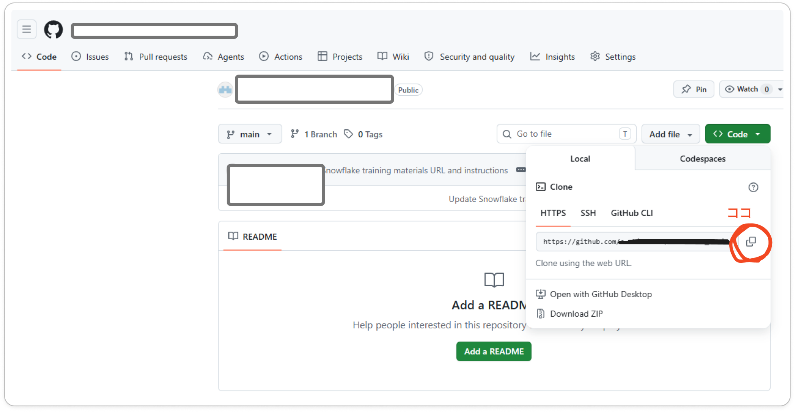
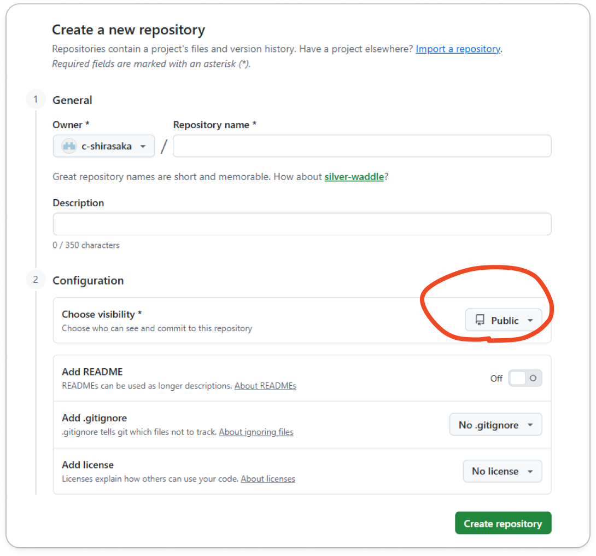
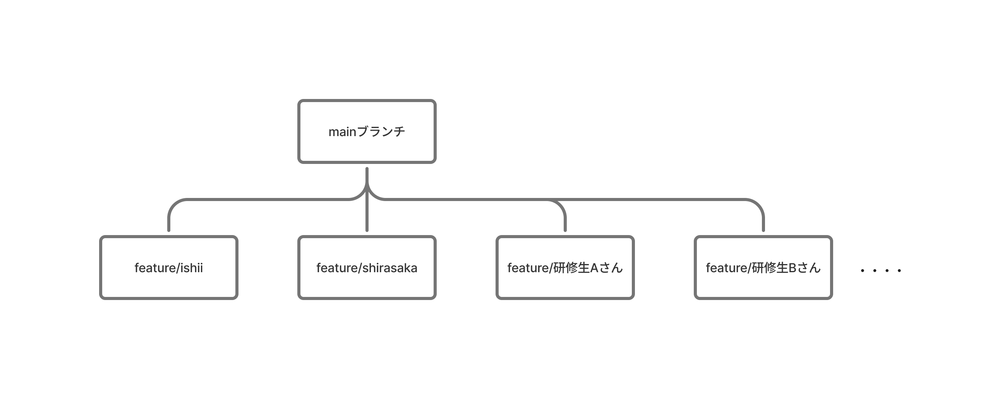
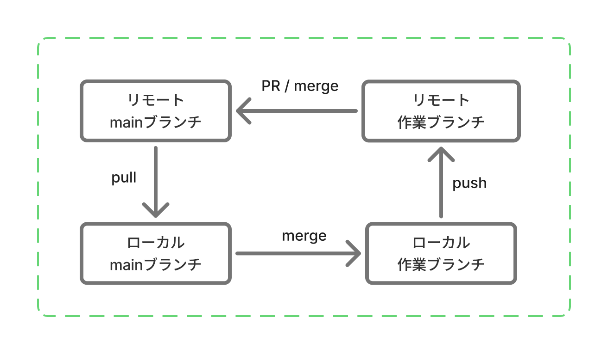

# Git / Github

Snowflake研修用に特化した解説

## 目次
- [なんでGit？](#なんでgit)
- [GitとGithubは全く別物](#gitとgithubは全く別物)
- [【★★★】まずはここから！基本の概念と操作](#まずはここから基本の概念と操作)
- [【★★】実際の業務で必要な知識](#実際の業務で必要な知識)
- [トラブルシューティング](#トラブルシューティング)

---
## なんでGit？

- 失敗したとき、もとに戻せる！（バージョン管理機能）
- みんなで共同作業できる（マージ / コンフリクト解決）

最初はこの2つが分かれば万事OK☆

## GitとGithubは全く別物

Githubの略称がGit…とかでは決してない。

- Gitはファイルのバージョン管理ツール。
- Githubは、Gitを使用して使いやすくした人気のWebサービス。

Githubのようなサービスは他にもたくさんある。
Gitで登場する概念とGithubの使い方を理解できれば、とりあえず他の場面でも通用する。
GitもGithubも基本無料なので、全部1人で実際にやってみることが可能。やりましょう。

---

## 【★★★】まずはここから！基本の概念と操作

### Gitでよく聞く概念

Git以外でも登場する単語である

- **ローカル**：自分のパソコン内
- **リモート**：GitHubなどのサービスが提供しているクラウド（サーバー内）を指すことが多い
    > Gitにおける「リモート（Remote）」とは、直訳すると「遠隔の」という意味です
    > 
    
    > 社内にある専用の物理サーバーや、ネットワークで繋がっている隣の席の人のパソコンであっても、そこにGitの保存場所を作れば、Gitにとっては立派な「リモート（外部のリポジトリ）」になります
    >


### リポジトリをクローンしよう

**リポジトリとは？**：ファイルや履歴の保管庫。つまりプロジェクト。製品。

- **初期設定**：コミット(=履歴)に記録される「作者情報（表示名・メールアドレス）」を設定する。※GitHub等へのログイン認証情報ではないが、Github等のアカウント情報と一致させることで、いいことがある。
    
    ```bash
    # ユーザー名の設定
    git config --global user.name "Github等のアカウント名"
    
    # メールアドレスの設定
    git config --global user.email "Github等のアカウントメールアドレス"
    ```

    以下のコマンドで、設定内容を確認できる。下の方にスクロールすると、user.nameとuser.emailが表示される。「q」で確認モードから抜ける(Linux操作)。
    ```bash
    git config --list
    ```
    
- **クローン**：既存のリポジトリをまるごとダウンロード
    まず、Cドライブ直下にフォルダを作成する    
    ```bash
    mkdir Git # Gitという名前のフォルダを作成する
    cd Git # 作ったフォルダ内に移動する
    ```
    クローンする
    ```bash
    # クローン
    git clone リポジトリURL(https://... .git)
    ```
    
    クローン時に入力するリポジトリURLは、各Gitサービスで取得できる。
    


### ちなみに：リポジトリを作成するとき

**Publicのままだと全世界公開となります**。Privateにしましょう



### ブランチを切る
今回のブランチ構造はこんな感じになる：


#### ブランチとは
自分の作業ワークスペースみたいな。枝分かれ。

#### ブランチを切る(=作成する)
今回の場合、**main**という名前のブランチが最初から存在します。

mainブランチの下に新しく自分のブランチを作る場合は、以下の通り。
mainブランチに移動してから、新しいブランチを作成する。
研修の指示に従い、`feature/自分の名前`という名前のブランチを作成しましょう。

```bash
git switch main # mainブランチに移動する
git switch -c feature/自分の名前 # 新しいブランチを作成する
```

作成したブランチの中身を確認してみると、mainブランチの内容と同じになっていることが分かる。今のmainブランチの複製が出来上がり、そこで自分だけの作業を行うようなイメージ。
各人がそれぞれのブランチで色んな変更を行い、**完成しチェックもした綺麗な内容だけをmainブランチに**合流させていくのが、Gitの使い方である。

今いるブランチは以下のコマンドで確認できる

```bash
git status
```

> [!Note]
> **なぜ「feature」をつけるのか**
> 一般的に良いとされているルールだから、です。
> 機能開発は「feature」、バグ修正は「bugfix」、ドキュメント作成は「docs」をつけるといったルールが存在します。
> ただし、このルールをどの程度採用するかは、プロジェクトによって異なります。
> ブランチを作成する前に、確認しておくと良いと思われます。

#### 既存ブランチに移動する場合
git switch に `-c` を付けなければ、既存ブランチへの移動となる
```bash
git switch 既存のブランチ名
```


### 自分の変更内容をリモートにアップロードする
- **ステージ** ：変更したファイルのうち、どのファイルをコミットするかを入れておく箱のようなもの。「ステージに追加する」または「ステージングする」と表現される
    
    ```bash
    # 特定のファイルを追加する
    git add コミットしたいファイルのパス
    
    # 変更したファイルをすべて追加する
    git add .
    ```
    
- **コミット**： 履歴として残す
    
    > コミットは「履歴として残す」操作（ここがgitの一番の利点！）。コミットしていない変更は履歴として固定されないので、事故ると戻しにくい。**ゲームのセーブ感覚でこまめに**残すと安全。
    > 
    
    ```bash
    git commit -m "メッセージ。変更内容の要約を書く(問題が起きた時、あとで自分がわかるように)"
    ```
    
    以下のコマンドを実行すると、「コミットID コミットメッセージ」が一覧として表示される
    
    ```bash
    git log --oneline
    ```
    
- **プッシュ**：  これまでにコミットした内容をリモートにアップ
    
    ```bash
    git push origin ブランチ名
    ```

### その他、よく使うGit操作
以降、本研修では使用しないが、実務で頻繁に行う操作である。


#### 自分の変更内容をmainブランチに合流させる
プッシュしただけではまだ、ローカルの内容をリモートにアップロードしただけである。
Github(つまりリモート)上で**自分のブランチ**を確認すると、自分の変更内容は反映されている。しかし、**mainブランチ**を確認すると、自分の変更内容は反映されていないのである。

通常は、ここで**プルリクエスト**という操作を行い、承認待ちの状態にしておく。
担当者から承認されたら、以下のコマンドでmainへ合流させる。この操作を、**マージ**という。

ちなみに、Githubのプルリクエスト画面からワンクリックでできるため、そっちでやったほうが早くて確実でいい。

```bash
# まずmainブランチ(ローカル)の内容を最新にする
git switch main
git pull

# 自分のブランチにmainの内容を持ってくる
git switch 自分のブランチ
git merge main
```

> [!Note]
> 「プルリクエスト」はGithubの機能だが、GitLabやBitbucketなど他のGitサービスでも同様の機能が存在する

#### 他の人の更新内容を自分のブランチに取り込む
- **プル** ：リモートの更新内容を取り込み、ローカルブランチを更新する。基本的に、mainブランチの内容を自分のブランチに取り込むこととなる。ローカルの変更と競合するとコンフリクト（後述）が起きることがあるので、作業前に `git status` で状態確認すると安全。
    
    ```bash
    # 更新したいブランチに移動して実行
    git pull
    ```

### 重要！コンフリクトとかいう概念

**コンフリクトとは**：衝突！複数人で同じファイルを書き換えた状態
通常はコンフリクトが発生しないように作業を行う
コンフリクトが発生してしまった場合は、他のチームメンバーと相談しつつ、どちらの変更内容を優先させるかを決めたりする

---

## 【★★】実際の業務で必要な知識

### Gitの便利な機能
- **.gitignoreファイル** : Gitの監視から外すファイル一覧を管理。リポジトリ直下に置いてある。リポジトリごとに管理されるため、チーム開発の場合は自由に変更しない方がいい。変更してほしい内容があれば、チームに相談。
    
### GitHub

- EnvironmentsとSecrets : パスワードなどの機密情報を安全に管理
- **GitHub Actions** : 自動でテストや公開をしてくれる仕組み (CI/CD)
    - CI/CDとは(comming soon)


## トラブルシューティング

### 🔷 やっちまった時の一覧

- `git commit --amend "メッセージ"` ：コミットメッセージを間違えたので書き換えたい
- `git restore ファイルのパス`  ：ファイルを消しちゃった、元に戻したい！
- `git reset --hard コミットID`  ：タイムリープ（過去のセーブデータに強制的に戻す）
    
    [git reset / git restore](https://app.notion.com/p/git-reset-git-restore-37e284d2d6f5806bb6bcfe1da2ea54e9?pvs=21)

### 🔷 なんかpushできない(403エラー)
会社のPCを使用している場合、過去に使用した人の認証情報が残っている場合がある。
Windowsの場合、認証は認証情報マネージャーや **Git Credential Manager (GCM)** が管理している。
この認証情報は、一般的には初回Push時に保存されるらしい。

**認証情報を確認する方法**
1. コントロールパネルを開く
2. 「資格情報マネージャー」を検索
3. 「Windows資格情報の管理」を開く
4. `git:https://github.com` を削除

**なぜ403になるのか**
例えば以前、「GitHub Aアカウント」で認証していたPCで、「GitHub Bアカウント」のリポジトリへPushしようとすると、Gitは「このPCにはAアカウントの認証情報が保存されてるな」と判断してそのまま送信する。
GitHub側では「あなた(Aアカウント)にはこのRepositoryへの書き込み権限がありません」となり、403 Forbiddenになる。
つまり、認証は成功しているが、権限がない。

## おまけ
一応完全版、あります。以下のリンクです。汎用的な説明と自分のためのメモを随時更新中です。少しでも参考になれば幸いです。
とはいえ、上記の内容が理解できれば、あとはAIに聞くなどして自走できると思われます。
https://angry-open-36c.notion.site/Git-Github-37e284d2d6f580499c39ff2457e06750?pvs=74
