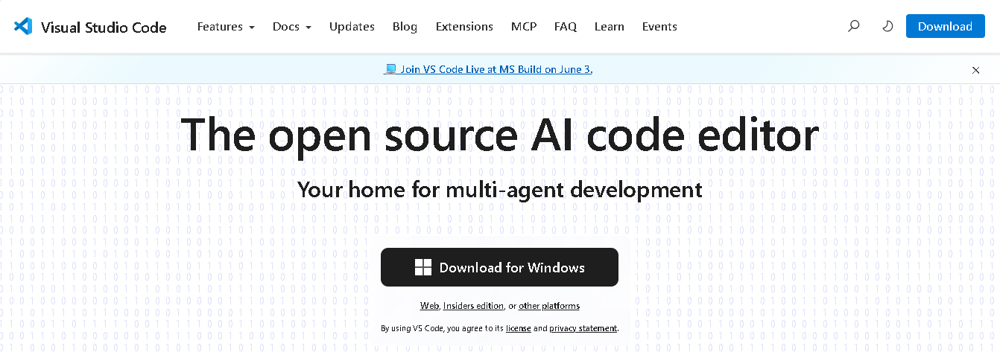
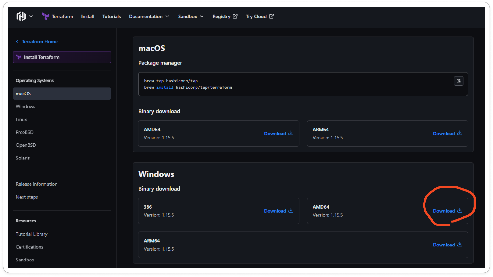
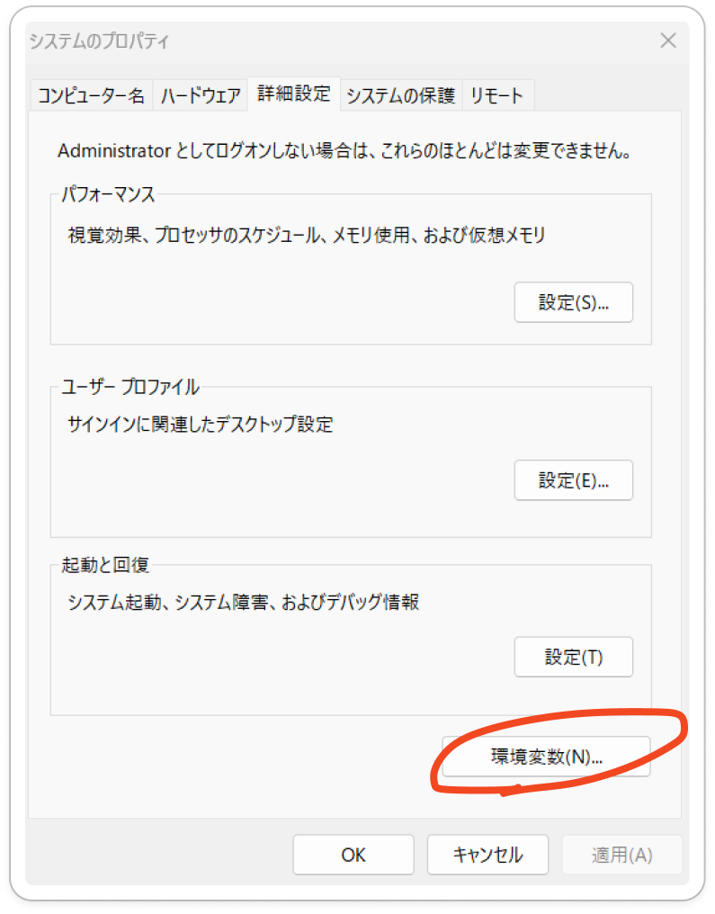
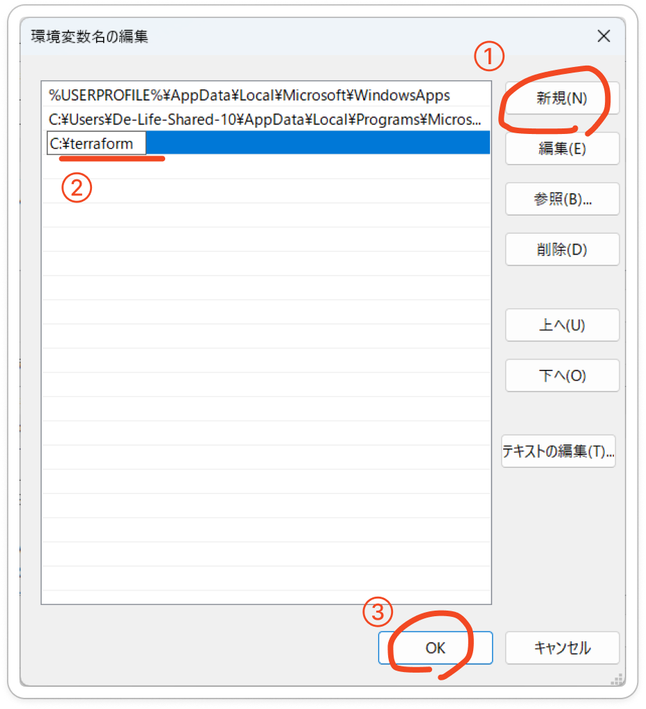
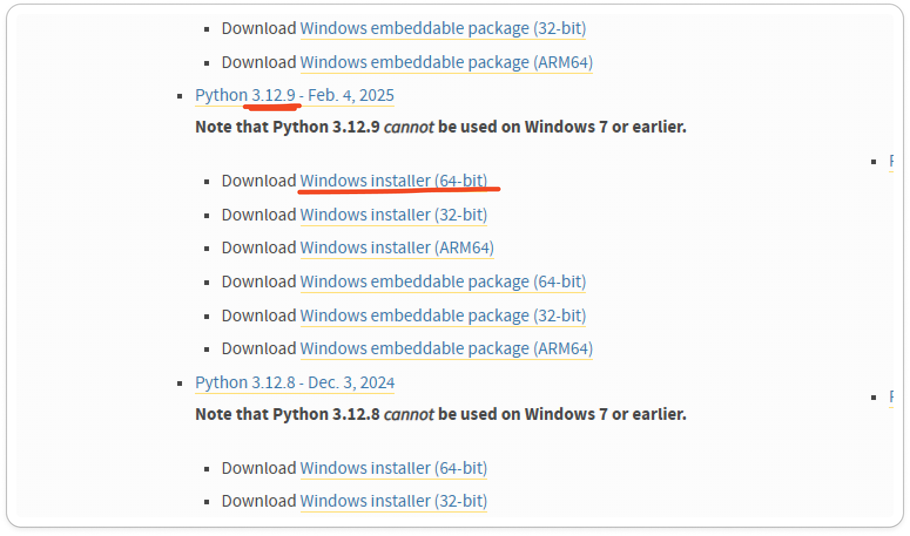
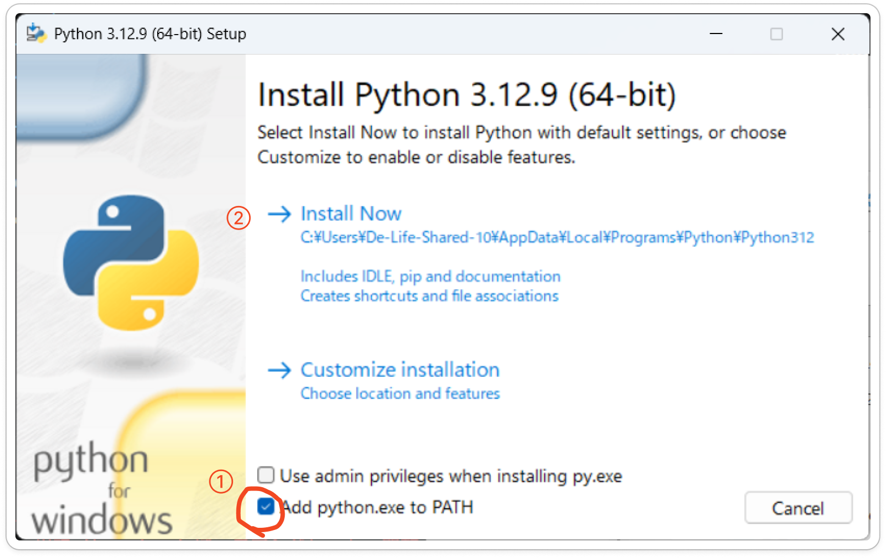
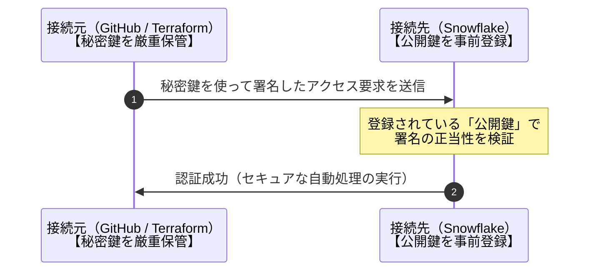
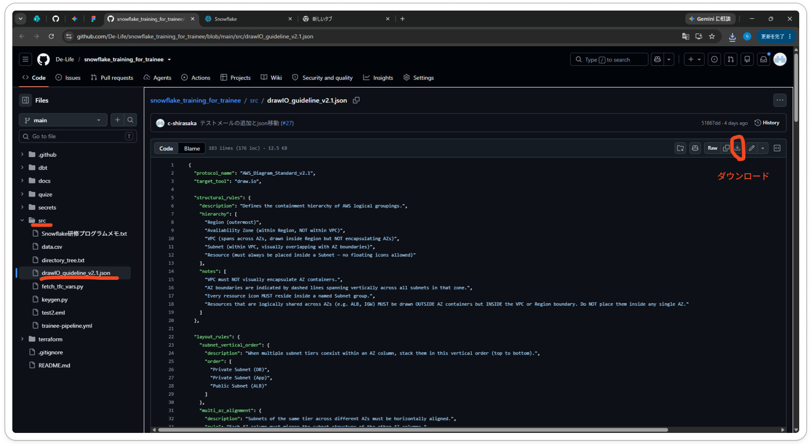
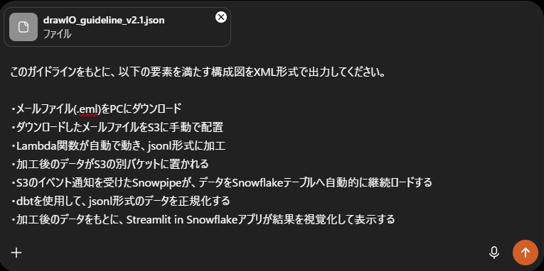

<div style="text-align:center;">
<p>【研修生用】</p>
<h1>Snowflake研修プログラム_ハンドアウト</h1>
<p>最終更新：2026/6/3</p>
</div>

<br>
<br>


# 研修概要

本研修の目的は、De-Lifeが開発したWebアプリケーションである **『ANCHOR』** の簡易版を作成することです。

## ANCHORとは
営業チーム向けのWebアプリケーションです。  
営業チームには、日々大量の案件・人材に関するメールが届きます。条件に適合するものをOutlookの検索機能だけで見つけることは、とても負荷の高いタスクです。  
ANCHORはそうした課題を解決するために開発されました。Outlookに届くメールをAWSに集積し、SnowflakeのAI機能を用いて分類・加工・可視化します。これにより、営業チームの負担を大幅に軽減し、業務の効率化に貢献しています。

## 本番環境と研修環境の違い
本研修では、ANCHOR の仕組みを学ぶため、以下のように簡略化しています。

**ANCHOR**
常に自動でメールを取得し、自動でデータ加工をしている。

<details>
<summary>技術的な詳細</summary>

1. Microsoft Graph APIでOutlookと連携（メールを自動取得）
2. AWS ECS内のスクリプトがデータ加工

</details>

<br>

**研修版**
メールファイルをAWSのS3という場所に自分で置くと、データ加工処理が自動実行される

<details>
<summary>技術的な詳細</summary>

1. メールファイルをS3に配置する（手動操作）
2. Lambda関数が自動で動き、jsonl形式に加工
3. dbtがさらに加工

</details>

---

より詳細な部分は、これから本研修を通して理解を深めていきましょう。

複数のサービスを組み合わせて成り立つアプリケーションになるので、「今はどんな目的で、何の実装をしているのか？」を常に考えながら研修に臨むようにしてください。


<br>

# 研修の目的

AWS・Snowflake等の基礎技術を習得するとともに、スキルシートにも記載可能な実務経験を獲得すること。

<br>


# 対象者
本研修の対象者として、以下を想定しています。

- SnowPro Core資格保有者【必須】

- AWS SAA (Solution Architect - Assosiate)【推奨】

<br>


# 技術スタック
本研修で触れる技術要素は以下の通りです。

- Snowflake
  - SQL
    - 関連：CRUD操作
  - RBACに基づくロール／権限管理
  - Stream、Task、Snowpipeによるデータパイプライン実装
  - Streamlit

- AWS
  - CloudFormation
  - IAM
  - S3
  - Lambda

- 言語
  - Python
  - YAML
  - JSON
  - XML

- その他
  - Terraform
  - dbt
  - Git
  - GitHub Actions (CI/CD)
  - draw&#46;io

<br>

# カリキュラム

1. [ローカル環境のセットアップ（1h）](#chapter-1)

2. [概要レクチャー（1h）](#chapter-2)

3. [構成図の作成（4h）](#chapter-3)

4. [AWS環境構築（6h）](#chapter-4)

5. [HCP Terraform環境構築（4h）](#chapter-5)

6. [GitHub環境構築（4h）](#chapter-6)

7. [TerraformによるSnowflakeオブジェクトの定義（6h）](#chapter-7)

8. [dbtによるデータ加工（8h）](#chapter-8)

9. [Streamlitアプリケーションの実装（8h）](#chapter-9)

10. [レポート作成（1h）](#chapter-10)

11. [オプション課題（7h）](#chapter-11)

※全5日(50h)の課程を想定。
各用語の理解等にかかる時間も含まれています。

<br>


<a id="chapter-1"></a>

## 1.ローカル環境のセットアップ（1h）

### 1. Git/Git Bash
DLリンクからインストーラーをダウンロードし、実行する。
デフォルト設定のまま「Next」を選択し、インストールの完了を待つ。

**DLリンク：** <https://git-scm.com/downloads/win>


インストール完了後、PCに「Git Bash」というアプリが追加される。
それを起動し、以下のコマンドを実行する。

```bash
# インストール確認：
git --version
```

> [!Note]
> 以降のコマンドは、Git Bashで実行することを前提として進めています。しかし、本研修中に使用するコマンドは、コマンドプロンプト等の他コマンドラインツールでも実行可能です。
> 詳しく知りたい方は、**Shell**について勉強することをお勧めします。

<br>


### 2. VSCode

**DLリンク：** <https://code.visualstudio.com/>

インストーラーを実行し、デフォルト設定のままインストール。



<br>

### 3. HashiCorp Terraform（VSCode拡張機能）

VSCodeを起動し、以下の手順で導入：

左サイドバー \> 拡張機能アイコン \> 検索欄に「HashiCorp Terraform」と入力 \> インストール \> 有効化\


<br>

### 4. Terraform CLI

**DLリンク：** <https://developer.hashicorp.com/terraform/install>

1.  Windows用のzipファイルをダウンロード\
    

2.  zipを解凍し terraform.exe を取り出す

3.  任意のフォルダ（例：C:\terraform）に配置

4.  環境変数のPathに追加\
    \
    \
    

> [!Note]
> **参考【環境変数とは】**：
> <https://qiita.com/x-rot/items/7a4ecab94f124f89f715>

```bash
# インストール確認：
terraform --version
```

<br>

### 5. Python 3.12

**DLリンク：** <https://www.python.org/downloads/windows/>\


インストーラーを実行。**インストール時に以下を必ず有効化すること：**

`☑ Add Python to PATH\`


```bash
# インストール確認：
python --version

# 必要パッケージのインストール：
pip install cryptography
pip install dbt-snowflake

# dbtインストール確認：
dbt --version
```

<br>

## 注意事項

・各ツールのインストール後はターミナルを再起動してから動作確認すること\
・**<u>Python 3.14はdbt-snowflakeに非対応のため必ず3.12を使用すること</u>**\
・Pathの設定が反映されない場合はPCを再起動すること

<br>

<a id="chapter-2"></a>

## 2. 概要レクチャー（1h）

### 本研修の流れ
各章は＜手順概要＞＜課題＞＜解説＞の3節で構成されています。
＜手順概要＞を読んでから＜課題＞に取り組み、できあがった成果物を指定のフォルダ（後述）に格納してください。課題を終えたら、＜解説＞を確認して理解を深めましょう。

知らない概念やわからない言葉が出てきたら、適宜[Snowflake研修リファレンス](【参考資料】Snowflake研修プログラム_リファレンス.md)をご参照ください。

### 本研修の要件
- 以下のリンク先に成果物提出用フォルダを用意している。成果物を提出する課題をクリアした場合、そのフォルダに成果物をアップロードすること。
[SharePointリンク](https://delifecoltd.sharepoint.com/sites/De-Life/Shared%20Documents/Forms/AllItems.aspx?id=%2Fsites%2FDe%2DLife%2FShared%20Documents%2F03%5F%E3%82%BD%E3%83%AA%E3%83%A5%E3%83%BC%E3%82%B7%E3%83%A7%E3%83%B3%E9%96%8B%E7%99%BA%E6%9C%AC%E9%83%A8%2F04%5F%E3%83%95%E3%83%AA%E3%83%BC%E3%83%95%E3%82%A9%E3%83%AB%E3%83%80%2Fsnowflake%2F%E7%A0%94%E4%BF%AE%E8%B3%87%E6%96%99%2F%E4%BA%8C%E6%AC%A1%E7%A0%94%E4%BF%AE%2F%E7%A0%94%E4%BF%AE%E7%94%9F%E7%94%A8&viewid=d0fd2bfd%2Db7e2%2D4131%2Db199%2D25ce6d74b7c6)

- 成果物のファイル名は **「（氏名）\_（章番号）成果物」** とすること。

- 成果物アップロード時の報告義務は無い。ただし、全過程をクリアした際は、Teamsの**研修進捗連絡**チャネルにて報告すること。

- 研修中の質問・連絡等はTeamsの**研修進捗連絡**チャネルで行うこと。研修生ごとに用意された個別スレッド内でやり取りを行うこと。

### 本研修で留意すべきこと
- 基本的に、本研修中に各自で作成したブランチ"feature/\<name\>"にて作業を行う。
- mainへのpushは不可としている。

詳細は6章に記載しています。Git / Githubの理解を深めたうえで、上記の留意点を頭に入れておいてください。 

### 知っておくべきITリテラシー
#### 秘密鍵の取り扱い
本研修の環境構成では公開鍵と秘密鍵のペアを用いた公開鍵暗号方式による認証(キーペア認証)を採用しています。
特に秘密鍵は紛失時の再発行が不可能であり、万が一外部へ漏洩した場合は、不正アクセスや多額の不正利用請求などの**重大なセキュリティインシデント**に直結します。

本研修で鍵に触れることはありませんが、今後、秘密鍵・公開鍵を取り扱う場面も想定されます。仕組みを理解できるようにしておいてください。


<br>

### 本研修の構成図


こちらが、本研修の構成図となります。
詳細は以下の通りです。

1. メールファイル(.eml)をPCにダウンロード
2. ダウンロードしたメールファイルをS3に手動で配置
3. Lambda関数が自動で動き、jsonl形式に加工
4. 加工後のデータがS3の別バケットに置かれる
5. S3のイベント通知を受けたSnowpipeが、データをSnowflakeテーブルへ自動的に継続ロードする
6. dbtを使用して、jsonl形式のデータを正規化する
7. 加工後のデータをもとに、Streamlit in Snowflakeアプリが結果を視覚化して表示する

> [!Important]
次章から、実際の研修がスタートします。

---


<a id="chapter-3"></a>

## 3. 構成図の作成（4h）
本章では、本研修プログラムで作成するアプリケーションの構成図を作成します。\
構成図の作成には[draw.io](https://app.diagrams.net/)というツールを使用します。手動で一から作成することもできますが、ここではAI（LLM）に構成図のコード（XML）を出力させる方式で手順を記載しています。


### ＜手順概要＞

- [こちら](../src/drawIO_guideline_v2.1.json)から、構成図ガイドライン（.json）をダウンロードします。こちらのガイドラインは、「構成図を作成する際は公式のアイコンを使用してください」といったAIへの指示が含まれています。

- 任意のAIを使用して、課題を満たす構成図をXML形式で出力させます。その際、ガイドライン(.json)を添付し、それに沿うように指示します。

- draw.ioのメニュー「その他」> 「図を編集する...」を選択し、出てきた画面にXMLを貼り付けします。その後、「適用」ボタンを押下します。

- draw.ioの画面に構成図が表示されるはずです。必要に応じて、手動で修正を加えます。構成図が表示されなかった場合は、XMLの内容に問題があるかも知れません。


### ＜課題＞
[本研修の構成図](#本研修の構成図)で知り得た情報を基に、本研修で作成するアプリケーションの構成図を作成してください。

### ＜解説＞
<details>

  <summary>構成図例</summary>
  「本研修の構成図」と同じ内容が表現されていれば問題ないとします。
  

</details>
<details>

  <summary>構成図出力までの流れ</summary>

  まずjsonをダウンロードします。
  

  任意のAIを使用し、構成図をXML形式で作成してもらいます。自分の理解をもとに指示ができていれば完璧です。
  

  出力されたXMLをコピーし、draw.ioに適用します。
  

  手動で微修正を行います。上記の「構成図例」と同じ内容が表現されていれば問題ないです。

</details>

<br>

<a id="chapter-4"></a>

## 4. AWS環境構築（6h）

本章では、AWS環境の構築を行います。

今回は**CloudFormation**を活用し、IaCによるリソース構築を実践します。作成するリソースは**IAMロール**、**S3バケット**、**Lambda関数**です。

不明な用語については[Snowflake研修リファレンス](【参考資料】Snowflake研修プログラム_リファレンス.md)の「AWS 環境構築」章を参照しつつ進めてください。

> [!WARNING]
この章以降、ソースコード等のファイルを編集することになりますが、**<u>それらの内容は意図的に不完全な状態になっています。そのまま実行しても正常に動作しないことにご留意ください。</u>**
> 
> また、ファイルの編集はVSCodeで行いましょう。

### ＜手順概要＞

- 指定されたユーザーで、AWSコンソールにログインします。
  <br>

- 以下のリンクはS3のバケットを示しています。そこにある**qz-trainee-pipeline.yml**をダウンロードします。こちらがCloudFormationのテンプレートとなりますが、中身は不完全な状態になっています。課題の要件を満たすように、このファイルをローカルで編集します。

  [CloudFormationテンプレート格納場所](https://ap-southeast-2.console.aws.amazon.com/s3/buckets/cloudformation-templates-mybucket?region=ap-southeast-2&prefix=trainee/&showversions=false)

  <br>

- 完成したテンプレートを、任意のファイル名を変更した上で同フォルダに配置します。
  <br>

- 当該テンプレートを指定して、CloudFormationでスタックを実行します。なお、スタック名は『<ユーザー名>-pipeline』としてください。パラメータには『<ユーザー名>』を入力してください。
  <br>
  
- 作成されたバケット『\<ユーザー名\>-bucket』の配下に、『raw_emails/』および『messages/』フォルダを作成してください。
  <br>

- Lambda関数が正常に機能するか、試験してください。『raw_emails/』フォルダにテスト用メールファイル(.eml, 日報等でも良い)をアップロード後、『messages/』フォルダに加工済みのjsonlファイルが格納されていれば成功です。

### ＜課題＞

CloudFormationを用いて、以下の要件を満たすようにAWSリソースを作成してください。

**■ 要件**

- 『\<ユーザー名\>-bucket』という名称のバケットを作成する。

- 同バケットに対して、作成者および以下に列挙する管理者が、任意の操作が可能である。

  - 'arn:aws:iam::875180007397:user/SHINJI_KUROSAKI'

  - 'arn:aws:iam::875180007397:user/TAKUYA_INOUE'

  - 'arn:aws:iam::875180007397:user/CHIHIRO_SHIRASAKA'

  - 'arn:aws:iam::875180007397:user/TAIGA_ISHII'

**■ テンプレート格納場所**
[trainee/](https://ap-southeast-2.console.aws.amazon.com/s3/buckets/cloudformation-templates-mybucket?prefix=trainee/)


### ＜解説＞
<details>
<summary>qz-trainee-pipeline.ymlの模範解答はこちら</summary>

```yml
# ~省略~

Parameters:
  TraineeUserName:
    Type: String
    Description: 'Enter your trainee username (e.g. trainee01)'
    AllowedPattern: '^trainee[0-9a-z-]+$'
    ConstraintDescription: 'Must start with "trainee" followed by alphanumeric characters or hyphens (e.g. trainee01)'

Resources:
  # 1. S3バケット
  MailBucket:
    Type: 'AWS::S3::Bucket'
    DependsOn: LambdaPermission
    Properties:
      BucketName: !Sub '${TraineeUserName}-bucket'
      NotificationConfiguration:
        LambdaConfigurations:
          - Event: 's3:ObjectCreated:*'
            Filter:
              S3Key:
                Rules:
                  - Name: prefix
                    Value: 'raw_emails/'
                  - Name: suffix
                    Value: '.eml'
            Function: !GetAtt EmlProcessorFunction.Arn
      Tags:
        - Key: Owner
          Value: !Ref TraineeUserName

# 2. バケットポリシー
  MailBucketPolicy:
    Type: 'AWS::S3::BucketPolicy'
    Properties:
      Bucket: !Ref MailBucket
      PolicyDocument:
        Version: '2012-10-17'
        Statement:
          - Sid: AllowOwnerAccess
            Effect: Allow
            Principal:
              AWS: !Sub 'arn:aws:iam::875180007397:user/${TraineeUserName}'
            Action: 's3:*'
            Resource:
              - !Sub 'arn:aws:s3:::${TraineeUserName}-bucket'
              - !Sub 'arn:aws:s3:::${TraineeUserName}-bucket/*'
          - Sid: AllowAdminAccess
            Effect: Allow
            Principal:
              AWS:
                - 'arn:aws:iam::875180007397:user/SHINJI_KUROSAKI'
                - 'arn:aws:iam::875180007397:user/TAKUYA_INOUE'
                - 'arn:aws:iam::875180007397:user/CHIHIRO_SHIRASAKA'
                - 'arn:aws:iam::875180007397:user/TAIGA_ISHII'
            Action: 's3:*'
            Resource:
              - !Sub 'arn:aws:s3:::${TraineeUserName}-bucket'
              - !Sub 'arn:aws:s3:::${TraineeUserName}-bucket/*'
          - Sid: AllowLambdaGetObject
            Effect: Allow
            Principal:
              AWS: !GetAtt LambdaExecutionRole.Arn
            Action:
              - 's3:GetObject'
              - 's3:GetObjectVersion'
            Resource: !Sub 'arn:aws:s3:::${TraineeUserName}-bucket/*'
          - Sid: AllowSnowflakeAccess
            Effect: Allow
            Principal:
              AWS: 'arn:aws:iam::875180007397:role/snowflake-storage-integration-role'
            Action:
              - 's3:GetObject'
              - 's3:GetObjectVersion'
              - 's3:ListBucket'
            Resource:
              - !Sub 'arn:aws:s3:::${TraineeUserName}-bucket'
              - !Sub 'arn:aws:s3:::${TraineeUserName}-bucket/*'
          - Sid: DenyOthers
            Effect: Deny
            Principal: '*'
            Action: 's3:*'
            Resource:
              - !Sub 'arn:aws:s3:::${TraineeUserName}-bucket'
              - !Sub 'arn:aws:s3:::${TraineeUserName}-bucket/*'
            Condition:
              StringNotEquals:
                'aws:PrincipalArn':
                  - !Sub 'arn:aws:iam::875180007397:user/${TraineeUserName}'
                  - 'arn:aws:iam::875180007397:user/SHINJI_KUROSAKI'
                  - 'arn:aws:iam::875180007397:user/TAKUYA_INOUE'
                  - 'arn:aws:iam::875180007397:user/CHIHIRO_SHIRASAKA'
                  - 'arn:aws:iam::875180007397:user/TAIGA_ISHII'
                  - !GetAtt LambdaExecutionRole.Arn
                  - 'arn:aws:iam::875180007397:role/snowflake-storage-integration-role'
                  - 'arn:aws:iam::875180007397:root'


# ~省略~
```

</details>
<details>
  <summary>詳細解説</summary>

  - **ユーザー名**
    - ユーザー名は、自身の使用しているtraineeユーザー名を入力してください。


  - **バケット名**
    - AWSテンプレートにおいては、`${パラメータ名}`とすることで、Parametersで定義したパラメータを参照することができます。
    - 今回定義しているパラメータはTraineeUserNameなので、`${TraineeUserName}-bucket`と記述するのが正解です。


  - **バケットポリシーのPrincipal**
    - AllowOwnerAccessの方では、自身のユーザーを指定します。ただし、ARNで指定する必要があるので、以下の通り記述するのが正解です。
      - `arn:aws:iam::875180007397:user/${TraineeUserName}`
    - AllowAdminAccessの方は、問題文に記載されている4つのARNを指定します。

</details>

<br>

<a id="chapter-5"></a>

## 5. HCP Terraform環境構築（5h）
本章では、HCP Terraformの環境構築を実施します。
HCP Terraformは、クラウドベースのTerraform実行環境です。環境変数の管理や、CI/CDパイプラインとの連携が可能です。

本アプリケーション中のTerraformは、HCP Terraform上で動作します。

なお、dbt用のワークスペースも必要ですが、そちらは管理者側で用意したものを共用します。

### ＜手順概要＞
- 事前に作成したアカウントでHCP Terraformにログインします。

- AWSにログインし、必要な情報を参照しながら、課題をクリアしてください。

### ＜課題＞
① HCP Terraformの組織「snowflake-training」内に、任意の名称でworkspaceを作成してください。種類はAPI-Driven Workflowを選択してください。  
また、「training」というタグを付与してください。valueの設定は不要です。

② 新規作成したworkspaceに、以下の環境変数を登録してください。各Keyに対応するValueは、各々で異なる値となります。自身で調べてみましょう。

| Key                        | Value                 | Category  |
|----------------------------|-----------------------|-----------|
| TF_VAR_s3_bucket_url      | <span style="color:red;">?</span>                     | env |
| TF_VAR_snowflake_aws_role_arn      | <span style="color:red;">?</span>                     | env |
| TF_VAR_trainee_name     | <span style="color:red;">?</span>                     | env |

③変数のCategoryとして"Terraform variable"または"Environment variable"を選択できました。Terraform変数と環境変数の違いを説明したテキストを作成し、成果物フォルダに作成してください。

### ＜解説＞
<details>
  <summary>解説はこちら</summary>

  ②
  今回設定している変数は、Snowflake側で読み込むS3バケットのURL、Snowflake用ロールのARN、および自身のユーザー名です。
  S3バケットのURLは、AWSコンソールからコピーして入力してください。
  snowflake_aws_role_arnは、AWS IAM のsnowflake-storage-integration-roleを参照し、ARNの値をコピーして入力してください。(arn:aws:iam::875180007397:role/snowflake-storage-integration-roleのような値になっていればOKです)

  | Key                                | Value                 | Category  |
  |------------------------------------|-----------------------|-----------|
  | TF_VAR_s3_bucket_url      | S3バケットURI | env |
  | TF_VAR_snowflake_aws_role_arn      | snowflake-storage-integration-roleのARN | env |
  | TF_VAR_trainee_name                | （任意）              | env       |

  ③
  Terraform変数はコード内の変数の解決、環境変数は実行環境に渡す変数（認証情報など）という使い分けが一般的です。  
  ただし、「TF_VAR\_」というプレフィックスを付与することで、環境変数もコード内変数として扱うことができます。

  また、環境変数の値には改行を含むことができないという制約があります。そのため今回は秘密鍵のみTerraform変数として定義しています。
  </details>

<br>

<a id="chapter-6"></a>

## 6. GitHub環境構築（4h）

本章では、GitHubの環境構築を実施します。
本アプリケーションにおいてGithubは、CI/CDパイプラインの中核、およびdbtの実行環境として機能します。

本章では、「リポジトリ」や「クローン」など、GitおよびGithubの用語が登場します。そちらについては[Snowflake研修リファレンス](【参考資料】Snowflake研修プログラム_リファレンス.md)の「Git」「Github」をご参照ください。
また、本章でGitHubの環境構築を実施する目的は、今後の6章・7章の内容をCI/CDで実行することにあります。CI/CDについては、リファレンスの「CI/CD パイプライン」をご参照ください。

### ＜手順概要＞

- Githubで[snowflake_training_for_traineeリポジトリ](https://github.com/ti2140/snowflake_training_for_trainee)を開き、課題①に沿って必要な環境変数を登録します。
- 課題②を実施し、SharePointの成果物提出フォルダに提出します。
- リポジトリをクローンし、課題③～④を実施します。

### ＜課題＞

①自身のユーザー名と同名のEnvironmentsを作成し、以下の環境変数を登録してください。表中の「?」となっている箇所は自身で特定し、登録してください。

| Name             | Value |
|------------------|-------|
| HCP_WORKSPACE_ID | <span style="color:red;">?</span>     |
| TF_WORKSPACE     | <span style="color:red;">?</span>     |

②Environmentsに登録した変数には、HCP Terrafomの認証情報が含まれていません。「なぜGitHubがHCPに登録されている変数を参照できるのか」を調査し、回答をWordまたはMarkdownに記述してください。

③**mainブランチの直下に**、『feature/\<名前\>』という名称でブランチを作成し、そのブランチに移動してください。

④README.mdを任意の内容に書き換え、変更内容をリモートにプッシュしてください。

> [!WARNING]
> 以降、特別な断りがない限り、課題③で作成したブランチにて作業を行います。

### ＜解説＞
<details>
  <summary>解説はこちら</summary>
  ①  
  2つの変数は、HCP Terraformのワークスペースを参照するためのものです。

  ワークフロー定義ファイル「ci_cd.yml」を見ると、HCP_WORKSPACE_IDは、dbt処理ステップ中で使用されていることがわかります。  
  よって、`dbt-workspaceのID：ws-wSwSw3TQ4Ni93Rjv`を入力するのが正しいです。

  一方でTF_WORKSPACEはTerraform処理ステップ中で使用されています。  
  よって、前章にて自身で作成いただいたworkspaceの情報を入力するのが正解です。なお、入力するのはIDではなくワークスペース名となります。

  ②  
  HCP Terraformの認証情報は、HCP_API_TOKENという形で、Secrets And Variables > Actions内で登録されています。  
  リポジトリ単位で管理されている変数と、環境単位で管理されている変数があることに留意してください。

  ③
  mainブランチの直下に新しくブランチを作成するため、まずはmainブランチに移動します。
  ```bash
  git switch main
  ```
  それから、feature/\<名前\>という名称のブランチを作成します。
  ```bash
  # 例：
  git switch -c feature/tanaka
  ```
  作成と同時に、そのブランチへ移動しているはずです。今いるブランチを確認したい場合は、`git status`を使用します。
  ```bash
  # 確認
  git status

  # 表示結果
  >> On branch <今いるブランチ名>
  ```

  ④
  Githubのリポジトリページ上で、作成したブランチに切り替えた後、README.mdの内容を確認してください。自身の変更内容が反映されていれば完了です。　
</details>

<br>

<a id="chapter-7"></a>

## 7. TerraformによるSnowflakeオブジェクトの定義（5h）

本章では、HCP Terraformを使用してSnowflake上にオブジェクトを作成することを目指します。

> [!Note]
> HCP Terraformは、クラウドベースのTerraform実行環境です。環境変数の管理や、CI/CDパイプラインとの連携が可能です。
> 本アプリケーション中のTerraformは、HCP Terraform上で動作します。

[snowflake_training_for_traineeリポジトリ](https://github.com/ti2140/snowflake_training_for_trainee)の「terraform」フォルダに、Snowflakeオブジェクトの定義が書かれたtfファイルが置かれています。
主要なファイルの解説、各ファイル間の依存関係については[Snowflake研修リファレンス](【参考資料】Snowflake研修プログラム_リファレンス.md)の「Terraform」章をご参照ください。
また、Snowflake側の理解も必要となります。リファレンスの「Snowflake 環境構築」をご参照し、どのオブジェクトがtfファイルで定義されているか理解することをおすすめします。

### ＜手順概要＞
- 課題①～③に沿って、対応するソースコードをVSCodeで編集します。

- 課題④・⑤を実施します。CI/CDパイプラインの**Terraformステップが**エラーなく動き、今回定義したオブジェクトが生成されていれば完了です。

### ＜課題＞
①『ci_cd.yml』を編集し、あなたが作業するブランチにpushおよびプルリクエストした際にワークフローが起動するよう、トリガーを変更してください。

②『schema&#46;tf』を編集し、スキーマの名称を正しく設定してください。[オブジェクト一覧](#オブジェクト一覧)を参照のこと。

③『pipeline&#46;tf』を編集し、パイプラインを定義するSQLクエリを正しく定義してください。 

④ ①～③の変更内容をリモートにpushしてください。

⑤ GitHubActionsでワークフローを手動実行し、CI/CDパイプラインの**Terraformステップが**エラーなく動くかを確認してください。また、Snowflake上で今回定義したオブジェクトが生成されていることを確認してください。

### ＜解説＞
<details>
  <summary>解説はこちら</summary>

  ①
  - 作業ブランチ
    - 作業ブランチ名はfeature/<自身の名前>となっているはずなので、『feature/<自身の名前>』とするのが適切です。
  - GitHub環境名
    - 正解は `${{ github.actor }}`です。今回は環境名=GitHubユーザー名としているので、この書式が成り立ちます。環境名を任意で設定している場合は、静的に指定する必要があります。
  - .tfファイルのディレクトリ
    - .tfファイルはterraformフォルダに配置されています。よって『terraform』が正解です。

  ②
  オブジェクト名一覧を参照すると、スキーマ名は『RAW』『NORMALIZED』であることがわかります。

  Terraform変数はコード内の変数の解決、環境変数は実行環境に渡す変数（認証情報など）という使い分けが一般的です。  
  ただし、「TF_VAR\_」というプレフィックスを付与することで、環境変数もコード内変数として扱うことができます。

  また、環境変数の値には改行を含むことができないという制約があります。そのため今回は秘密鍵のみTerraform変数として定義しています。
    
  ③
  正しいクエリは以下の通りです。COPYキーワードにはINTOを伴います。各オブジェクトの変数名は、variables.tfを参照すれば確認することができます。
  ```sql
  COPY INTO ${snowflake_database.training_db.name}.${snowflake_schema.training_raw.name}.${snowflake_table.mails_raw.name}
    FROM @${snowflake_database.training_db.name}.${snowflake_schema.training_raw.name}.${snowflake_stage.st_s3_mail.name}
    MATCH_BY_COLUMN_NAME = CASE_INSENSITIVE
  ```

  ④
  `ステージに追加→コミット→プッシュ`という流れで行います。
  まず、これまでの変更内容(= コミットしたい内容)をステージに追加します。
  ```bash
  # 全ての変更内容をステージに追加
  git add .

  # 特定のファイルのみ追加したい場合はこちら
  git add ファイルのパス
  ```
  コミットします。
  ```bash
  git commit -m "任意のメッセージ。変更内容を記載"
  ```
  リモートにプッシュします。「自分のブランチ名」は、6章で作成したfeature/<名前>となります。
  ```bash
  git push origin <自分のブランチ名>
  ```
</details>


<br>

<a id="chapter-8"></a>

## 8. dbtによるデータ加工（8h）

本章では、dbtを用いてテーブルデータを加工し、Streamlitアプリケーションで参照するテーブルを作成することを目指します。

[snowflake_training_for_traineeリポジトリ](https://github.com/ti2140/snowflake_training_for_trainee)の「dbt」フォルダに、sqlファイルが置かれています。
主要なファイルの解説、各ファイル間の依存関係については[Snowflake研修リファレンス](【参考資料】Snowflake研修プログラム_リファレンス.md)の「dbt」をご参照ください。

### ＜手順概要＞

- 課題①・②に沿ってdbtソースコードをVSCodeで編集し、課題③を実施します。

- Github上でリポジトリを開き、課題④を実施します。

- AWSコンソールのS3画面で課題⑤を実施します。

### ＜課題＞

①『dbt_projebt.yml』を編集し、以下の要件を満たすようなテーブルを作成してください。

**【要件】**

- テーブル名はclassify_text_labelである。

- 列LABEL(文字列型)、DESCRIPTION(文字列型)、SORT_ORDER(整数型)を持つ。

②『mails_normalized.sql』を編集し、MAILS_NORMLIZEDテーブルを適切に定義してください。

③ ①・②の変更内容をリモートにpushしてください。

④ GitHubActionsでワークフローを手動実行し、CI/CDパイプラインの**全ステップが**エラーなく動くかを確認してください。また、Snowflake上で今回定義したオブジェクトが生成されていることを確認してください。

⑤ 5章で作成した『\<ユーザー名\>-bucket』の『raw_emails/』フォルダに.emlファイルをアップロードし、 MAILS_NORMALIZEDテーブルに自動反映されることを確認してください。

### ＜解説＞
<details>
  <summary>解説はこちら</summary>
  ①  
  模範解答は以下の通りです。SORT_ORDERの型はintegerを指定するのが適切です。

  ```yaml
  seeds:
    mydbt:
      classify_text_labels:
        +schema: NORMALIZED
        +column_types:
          LABEL: varchar
          DESCRIPTION: varchar
          SORT_ORDER: integer
  ```

  ②  
  模範解答は以下の通りです。SUBJECTの列名はファイル上部に記載のCTEを参照してください。  
  FLOAT値であるSENTIMENT関数の戻り値を文字列に変換するには、CASE句で判定するのが適切です。

  ```sql
  SELECT
      MESSAGE_ID,
      SUBJECT,
      FROM_EMAIL,
      RECEIVED_AT,
      TRUE AS AI_PROCESSED,
      summary AS AI_SUMMARY,
      CASE
          WHEN category_raw NOT IN (
              SELECT LABEL FROM {{ this.database }}.NORMALIZED.CLASSIFY_TEXT_LABELS
          ) THEN 'その他'
          ELSE category_raw
      END AS AI_CATEGORY,
      CASE
          WHEN sentiment_score > 0.3 THEN 'positive'
          WHEN sentiment_score < -0.3 THEN 'negative'
          ELSE 'neutral'
      END AS AI_SENTIMENT,
      keywords AS AI_KEYWORDS,
      OBJECT_CONSTRUCT(
          'summary', summary,
          'category', category_raw,
          'sentiment_score', sentiment_score,
          'keywords', keywords
      ) AS AI_RAW_RESULT,
      CURRENT_TIMESTAMP() AS NORMALIZED_AT
  FROM ai_processed
  ```

  ③
  7章④の解説をご参照ください。
</details>

<br>

<a id="chapter-9"></a>

## 9. Streamlitアプリケーションの実装（8h）

本章では、既存のStreamlitアプリケーションを複製し、pythonコードの編集によりアプリのビューを編集します。 
研修で作成したMAILS_NORMALIZEDテーブルを参照させることがゴールです。

### ＜手順概要＞
- Streamlitアプリケーションを開き、demo_applicationを複製します。

- 複製したアプリケーションのソースコードを直接編集し、参照先を切り替えます。

### ＜課題＞
①  
アプリケーションの参照元を、研修で作成したテーブルMAILS_NORMALIZEDに変更してください。  
その後、アプリ上で同テーブルのレコードが表示できることを確認してください。

②
詳細表示中のAI生出力（デバッグ用）ブロックを、非表示にしてください。

### 

### ＜解説＞
<details>
  <summary>解説はこちら</summary>

  ①  
  参照元テーブルは、ソースコードの冒頭で定義されています。  
  DB_NAMEの値を自身のデータベース名に変更することで、参照元を変更できます。

  ②  
  以下のコードブロックをコメントアウトすることで、該当のブロックを非表示にできます。

  ```py
  with st.expander("AI生出力（デバッグ用）", expanded=False):
      ai_raw = row.get("AI_RAW_RESULT")
      if ai_raw:
          try:
              parsed = json.loads(str(ai_raw)) if isinstance(ai_raw, str) else ai_raw
              st.json(parsed)
          except Exception:
              st.code(str(ai_raw), language=None)
      else:
          st.write("（なし）")
  ```
</details>

<br>

<a id="chapter-10"></a>

## 10. レポート作成（1h）

### ＜手順概要＞

- 下記の課題を実施します。

- [こちら](レポート用テンプレート.md)からレポート用テンプレートをダウンロードします。

- レポートの内容を確認し、各項目に記載をしてください。完了したら、Sharepointの成果物提出フォルダに提出します。「オプション課題」項目は次章で実施するため、ここでは飛ばしてください。

<br>

<a id="chapter-11"></a>

## 11. オプション課題（7h）

### ＜手順概要＞

- 下記の課題を実施します。

- 10章で作成したレポートの「オプション課題」項目に実施した内容を記述し、Sharepointの成果物提出フォルダに提出します。

### ＜課題＞

以下の要件に従って、新たなTODOアプリを作成してください。

**【要件】**
- 元データとして、.emlファイルを使用すること。メールにTODOを記載する形とする
- CortexAIを用いて、TODOの内容をカテゴリ分けする
  - 日付
  - 優先度
- アプリケーションはStreamlitで作成すること
- アプリケーション内で、以下のような表を表示すること
  | 期日 | TODO | 完了 / 未完了 | 優先度 |
  | --- | --- | --- | --- |
  | 2026/6/23 | Streamlitアプリを作成する | 未完了 | ☆☆☆ |

<br>

> [!Important]
> 研修はこれにて終了です。お疲れ様でした。
> 自身のワークスペースで、自由にStreamlitアプリを作成することも可能です。
> 可能な方は、どんどんやってみましょう。

---

<br>

# オブジェクト一覧

| **種別** | **オブジェクト名** | **役割** |
|----|----|----|
| DATABASE | \<NAME\>\_TRAINING_DB | 研修生ごとの専用DB。本番環境と完全分離。 |
| SCHEMA | RAW | S3から取り込んだメールの生データを保持するスキーマ。 |
| SCHEMA | NORMALIZED | 加工・正規化済みデータを保持するスキーマ。 |
| TABLE | RAW.MAILS_RAW | Snowpipeで取り込んだメール生データの格納先。 |
| TABLE | NORMALIZED.MAILS_NORMALIZED | Streamlitの参照元。TASKによる加工済みデータを格納。 |
| INTEGRATION | S3_INT | SnowflakeとS3バケット間のストレージ連携設定。IAMロールと紐づける。 |
| STAGE | RAW.ST_S3_MAIL | S3上のメールJSONLファイルを参照するための外部ステージ。 |
| PIPE | RAW.PIPE_S3_TO_MAILS_RAW | STAGEのファイルをMAILS_RAWへ自動ロードするSnowpipe。 |
| TASK | RAW.T_TRANSFORM_TO_NORMALIZED | MAILS_RAWのデータを加工し、MAILS_PROCESSEDへ書き込む定期タスク。 |
| PROCEDURE | NORMALIZED.SP_AI_SUMMARIZE | Snowflake CortexによるAI要約処理を実行するストアドプロシージャ。 |
| ROLE | FR_ANCHOR_DEMO_ROLE | 研修生に付与する既存ロール。研修DB内の操作権限を管理。 |
| USER | SVC_TERRAFORM | Terraformによるインフラ構築用サービスアカウント。 |
| USER | SVC_DBT | dbtによるクエリ実行用サービスアカウント。 |

<br>

# FR_ANCHOR_DEMO_ROLEの権限

| **対象** | **権限** | **用途** |
|----|----|----|
| ACCOUNT | CREATE DATABASE | 研修用DBの作成 |
| DATABASE ROLE SNOWFLAKE.CORTEX_USER | USAGE | Snowflake Cortex AI機能の使用 |
| INTEGRATION S3_INT | USAGE | S3ストレージ統合の使用 |
| DATABASE RECRUIT_MAIL_DB_DEMO | USAGE | デモアプリケーションDBへのアクセス |
| DATABASE SNOWFLAKE_LEARNING_DB | USAGE | 学習用DBへのアクセス |
| DATABASE \<NAME\>\_TRAINING_DB | USAGE | DBオブジェクトへのアクセス基礎 |
| SCHEMA RECRUIT_MAIL_DB_DEMO.PUBLIC | USAGE | デモアプリケーションスキーマへのアクセス |
| SCHEMA RECRUIT_MAIL_DB_DEMO.PUBLIC | CREATE STREAMLIT | デモ用Streamlitアプリ作成 |
| SCHEMA \<NAME\>\_TRAINING_DB.RAW | USAGE | スキーマオブジェクトへのアクセス基礎 |
| SCHEMA \<NAME\>\_TRAINING_DB.RAW | MODIFY | スキーマ設定変更 |
| SCHEMA \<NAME\>\_TRAINING_DB.RAW | MONITOR | スキーマ使用状況の確認 |
| SCHEMA \<NAME\>\_TRAINING_DB.RAW | CREATE TABLE | MAILS_RAW作成 |
| SCHEMA \<NAME\>\_TRAINING_DB.RAW | CREATE STAGE | ST_S3_MAIL作成 |
| SCHEMA \<NAME\>\_TRAINING_DB.RAW | CREATE PIPE | PIPE_S3_TO_MAILS_RAW作成 |
| SCHEMA \<NAME\>\_TRAINING_DB.RAW | CREATE TASK | T_TRANSFORM_TO_NORMALIZED作成 |
| SCHEMA \<NAME\>\_TRAINING_DB.RAW | CREATE FILE FORMAT | ファイルフォーマット定義 |
| SCHEMA \<NAME\>\_TRAINING_DB.RAW | CREATE STREAM | ストリーム作成 |
| SCHEMA \<NAME\>\_TRAINING_DB.RAW | CREATE VIEW | ビュー作成 |
| SCHEMA \<NAME\>\_TRAINING_DB.RAW | CREATE PROCEDURE | ストアドプロシージャ作成 |
| SCHEMA \<NAME\>\_TRAINING_DB.RAW | CREATE STREAMLIT | Streamlitアプリ作成 |
| SCHEMA \<NAME\>\_TRAINING_DB.NORMALIZED | USAGE | スキーマオブジェクトへのアクセス基礎 |
| SCHEMA \<NAME\>\_TRAINING_DB.NORMALIZED | MODIFY | スキーマ設定変更 |
| SCHEMA \<NAME\>\_TRAINING_DB.NORMALIZED | MONITOR | スキーマ使用状況の確認 |
| SCHEMA \<NAME\>\_TRAINING_DB.NORMALIZED | CREATE TABLE | MAILS_NORMALIZED作成 |
| SCHEMA \<NAME\>\_TRAINING_DB.NORMALIZED | CREATE PROCEDURE | SP_AI_SUMMARIZE作成 |
| SCHEMA \<NAME\>\_TRAINING_DB.NORMALIZED | CREATE VIEW | ビュー作成 |
| SCHEMA \<NAME\>\_TRAINING_DB.NORMALIZED | CREATE STREAMLIT | Streamlitアプリ作成 |
| SCHEMA \<NAME\>\_TRAINING_DB.NORMALIZED | CREATE STREAM | ストリーム作成 |
| SCHEMA \<NAME\>\_TRAINING_DB.NORMALIZED | CREATE TASK | タスク作成 |
| SCHEMA \<NAME\>\_TRAINING_DB.NORMALIZED | CREATE FILE FORMAT | ファイルフォーマット定義 |
| SCHEMA \<NAME\>\_TRAINING_DB.NORMALIZED | CREATE PIPE | パイプ作成 |
| SCHEMA \<NAME\>\_TRAINING_DB.NORMALIZED | CREATE STAGE | ステージ作成 |
| FILE FORMAT \<NAME\>\_TRAINING_DB.RAW.MAIL_JSONL_FORMAT | USAGE | メールJSONLフォーマットの使用 |
| STAGE \<NAME\>\_TRAINING_DB.RAW.ST_S3_MAIL | USAGE | S3外部ステージの使用 |
| STAGE \<NAME\>\_TRAINING_DB.RAW.ST_S3_MAIL | READ | ステージファイルの読み取り |
| TABLE \<NAME\>\_TRAINING_DB.RAW.MAILS_RAW | SELECT / INSERT / UPDATE / DELETE / TRUNCATE | メール生データの読み書き |
| TABLE \<NAME\>\_TRAINING_DB.NORMALIZED.MAILS_NORMALIZED | OWNERSHIP / SELECT / INSERT / UPDATE / DELETE / TRUNCATE | 加工済みメールデータの管理 |
| TABLE \<NAME\>\_TRAINING_DB.NORMALIZED.CLASSIFY_TEXT_LABELS | OWNERSHIP / SELECT / INSERT / UPDATE / DELETE / TRUNCATE | 分類ラベルデータの管理 |
| STREAMLIT RECRUIT_MAIL_DB_DEMO.PUBLIC.DEMO_APPLICATION | USAGE | デモアプリケーションの閲覧 |
| WAREHOUSE SNOWFLAKE_LEARNING_WH | USAGE | クエリ実行用ウェアハウスの使用 |
| WAREHOUSE MAIL_BI_WH | USAGE | クエリ実行用ウェアハウスの使用 |

